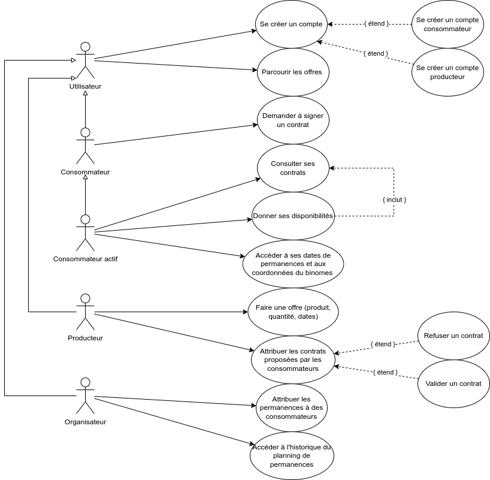
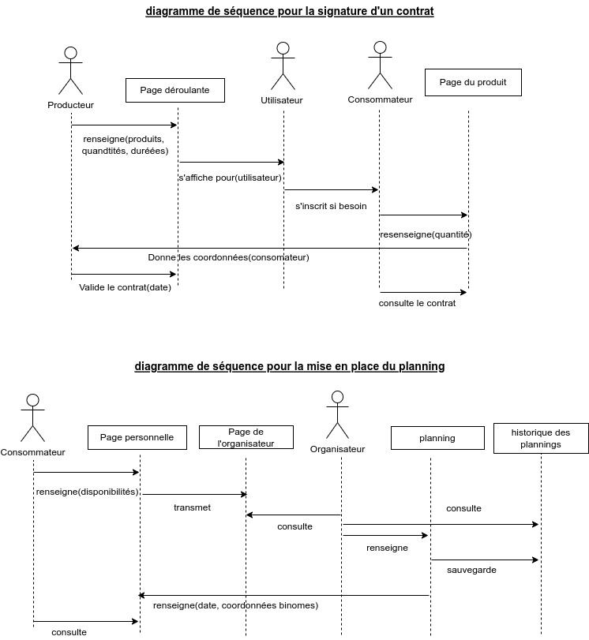
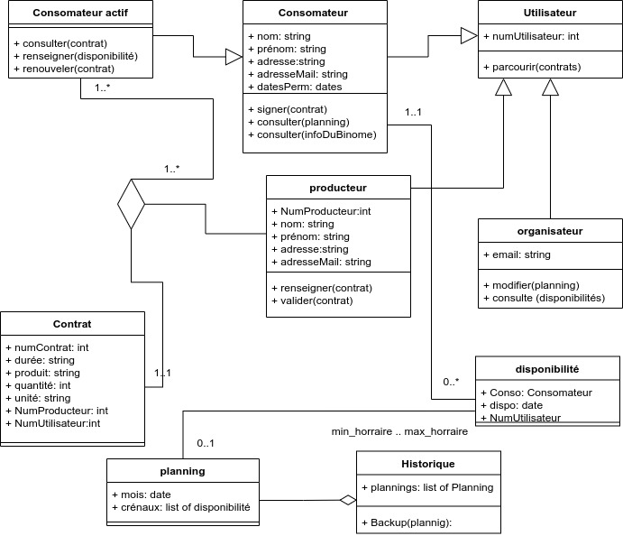
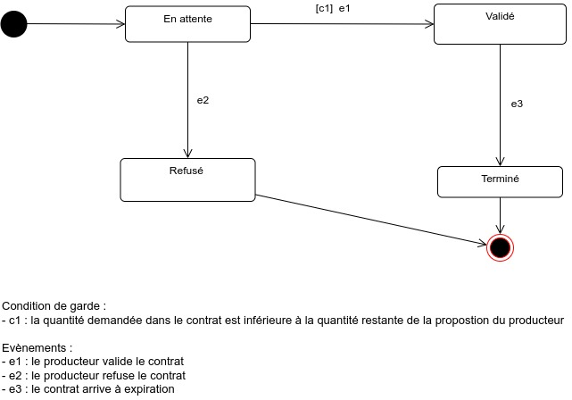
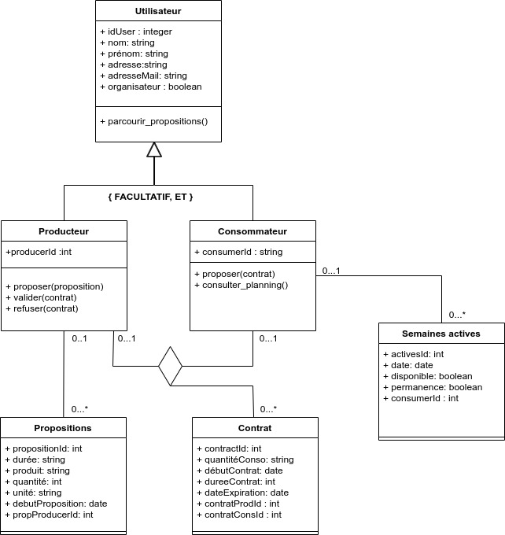
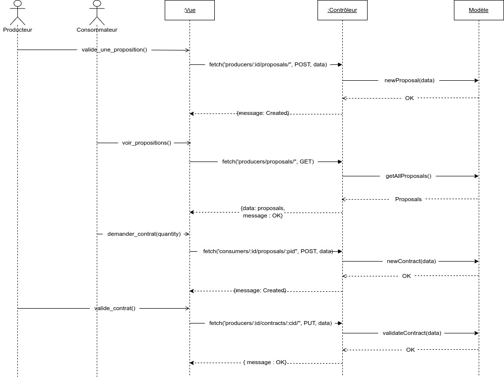

## Sommaire
- [1. Phase d'analyse](#1-phase-danalyse)
  - [Les acteurs](#les-acteurs)
  - [Diagrammes](#diagrammes)
  - [Commentaires des diagrammes](#commentaires-des-diagrammes)
- [2. Phase de conception](#2-phase-de-conception)
  - [Architecture MVC](#architecture-mvc)
  - [Diagrammes de conception](#diagrammes-de-conception)
- [3. Manuel d'utilisation](#3-manuel-dutilisation)
  - [Installation de l'application](#installation-de-lapplication)
  - [Lancement de l'application](#lancement-de-lapplication)
  - [Si vous ne souhaitez pas créer de compte](#si-vous-ne-souhaitez-pas-créer-de-compte)
  - [S'enregistrer sur l'application](#senregistrer-sur-lapplication)
  - [Se connecter à l'application](#se-connecter-à-lapplication)
  - [Se déconnecter de l'application](#se-déconnecter-de-lapplication)
  - [Si vous êtes un producteur](#si-vous-êtes-un-producteur)
  - [Si vous êtes un consomateur](#si-vous-êtes-un-consomateur)
  - [Si vous êtes Organisateur](#si-vous-êtes-organisateur)
- [4. Bilan du projet](#4-bilan-du-projet)

## 1. Phase d'analyse

La phase d'analyse est logiquement ce par quoi nous avons commencé le projet. Même si en parallèle, 2 personnes commencaient à mettre en place l'environnement de développement de l'application, par exemple l'émulateur de téléphone.

### Les acteurs

- utilisateur : un utilisateur de l'application
- consommateur inactif : un utilisateur qui crée un compte en tant que consommateur
- consommateur actif : un consommateur qui a au moins un contrat en cours avec un producteur
- producteur : un utilisateur qui crée un compte en tant que producteur
- organisateur : un utilisateur ayant un compte (producteur ou consommateur) et qui est désigné comme organisateur du planning de distribution

### Diagrammes 

Ci-dessous les diagrammes de la phase d'Analyse : 

\

\

\

\

\

### Commentaires des diagrammes

**Diagramme des cas d'utilisation** Il y a deux types de compte. Les comptes consommateur et les comptes producteur. Un même utilisateur, avec la même adresse mail peut se créer un compte producteur et un compte consommateur à la fois. Donner ses disponibilités nécessitent de consulter ses contrats car on propose ses disponibilités lorsqu'on a un contrat en cours. Le producteur fait une offre, et lorsqu'il recoit des propositions de contrat des producteurs, il a la possibilité de les accepter ou de les refuser. Les descriptions détaillées des cas d'utilisation sont faites dans le manuel utilisateur.

**Diagrammes de séquence**: Les deux principaux processus sont représentées par les deux diagrammes de séquence : la signature d'un contrat, ainsi que la mise en place du planning de distribution. Je pense que les diagrammes sont suffisamment explicites et ne nécessitent pas d'explication supplémentaire.

**Diagramme de classes d'analyse**:  Les différentes entités sont ici représentées. Tous les acteurs sont des utilisateurs de l'application, c'est pourquoi Consommateur actif, Consommateur, Producteur et Organisateur hérite d'Utilisateur. De plus ce diagramme exprime les relations entre les entités. Par exemple, un contrat relie un producteur et un consommateur actif. D'où l'association ternaire entre ces trois éléments.

## 2. Phase de conception

### Architecture MVC

L'arborescence globale de notre application est la suivante:

src/ \
__ frontend/ \
____ views/ \
__ backend/ \
____ controllers/ \
____ models/ \

#### Models

Les fichiers du répertoire models/ définissent la base de données de l'application. Le diagramme des classes logicielles (cf *Figure 4*) illustrent la définition de la base de données.

#### Controllers

Les fichiers du répertoire controllers/ sont composées des fonctions de contrôle. Toutes les requêtes passent par ces fonctions, qui vérifient certaines contraintes comme par exemple les droits de l'utilisateur.

#### Views

Les fichiers du répertoire views/ contiennent la partie visuel de l'application, et font appel au backend à travers des requêtes HTTP.

L'architecture MVC est imposée. Ici, il s'agit d'une architecture MVC 'moderne' (librairies Web récentes) de la forme : Vue <-> Contrôleur <-> Modèle.
Le Contrôleur fournit à la Vue les informations nécessaires quand cette dernière fait appel à lui à travers des requêtes HTTP. Pour founir justement ces informations, le contrôleur fait, lui, appel au Modèle. Il peut aussi modifier le Modèle (la base de donnnées) si une information est apportée par l'utilisateur. Par exemple, si un producteur ajoute une proposition: il remplit un champ dans l'application, il clique sur un bouton "Valider". Une requête HTTP est transmise au contrôleur, qui vérifie la cohérence de la proposition, et qui vient ajouter à la base de données (modèle) la proposition en question. Pour comprendre plus en détails les interactions entre les 3 parties, je vous renvoie vers la *Figure 6*, composée de deux diagrammes de séquence de conception.
 

### Diagrammes de conception

Ci-dessous les diagrammes de conception : 

\

\

\

\

\

\

\

\

#### Commentaires des diagrammes \

**Diagramme d'état transition associé à l'état d'un contrat**: Une fois qu'un consommateur fait une demande de contrat à partir d'une proposition d'un producteur, il faut encore que le producteur valide le contrat. C'est pour cette raison qu'il y a plusieurs états pour un contrat : ***en attente*** (que le producteur valide ou refuse), ***refusé*** (par le producteur), ***validé*** (par le producteur). De plus, il y a un état ***terminée*** lorsqu'

**Diagramme des classes logiciels**: Ce diagramme représente la définition de la base de données. Comme c'est indiqué, un utilisateur peut être à la fois un producteur et un consommateur, mais peut aussi n'être aucun des deux. Un contrat lie un producteur et un consommateur. Et chaque consommateur a des semaines actives (les semaines) où il a un contrat signé avec un producteur, et donc qu'il doit venir récupérer des produits.

**Diagramme de séquence conception** : Ce diagramme illustre les interactions entre les utilisateurs, et les différentes parties du modèle MVC. Il représente ici les actions réalisées lors de la signature d'un contrat. Comme expliqué précedemment, le Contrôleur demande de l'information au modèle (par exemple *getAllProposals()*) et peut aussi venir modifier la base de données (par exemple *newcontrat()*).

\

## 3. Manuel d'utilisation

### Installation de l'application

L'application est téléchargeable depuis le site de l'AMAP correspondante. Il suffit de cliquer sur télécharger et de mettre l'application à l'endroit voulu. 

### Lancement de l'application 

Pour lancer l'application, une fois que vous l'avez téléchargé, il suffit de cliquer sur l'icone correspondante sur votre téléphone. Un écran de bienvenu s'offre alors à vous. Nous allons détailler les différentes utilisations en fonctions de ce que vous voulez. 

### Si vous ne souhaitez pas créer de compte

L'application est utilisable en mode libre. Pour cela, sur l'écran d'acceuil, il suffit de cliquer sur **Voir les propositions en tant qu'invité** en bas de la page. Il apparaitra alors un menu déroulant avec différents contrats proposés par des agriculteurs producteurs. Il n'est pas possible de choisir et remplir un contrat lorsque l'on est pas connecté. Il faudra donc revenir en arrière en cliquant sur la flèche en haut à gauche de votre téléphone. Se référer aux paragraphes **S'enregistrer** ou **Se connecter** si vous êtes nouveaux ou non sur l'application.

### S'enregistrer sur l'application

Depuis l'écran d'accueil, vous pouvez cliquer sur **S'enregistrer**. Ainsi, vous serez redirigé vers une page où vous pouvez compléter vos informations personnelles. Il faut faire attention à ce que tous les champs soient correctement remplis. Ensuite, vous devez choisir en haut de la page le type de compte que vous désirez créer: compte producteur ou compte consomateur. Chaque adresse email peut se connecter à la fois à un compte producteur et à la fois à un compte consomateur. Attention, une adresse mail ne peut pas permettre de se connecter à deux comptes producteurs ou consomateurs différents. Une fois tous les éléments correctement sélectionné, vous pouvez à nouveau cliquer sur **S'enregistrer**, vous arriverez alors sur votre toute nouvelle page de profil.

### Se connecter à l'application

Pour cela, depuis la page d'accueil, vous devez cliquer sur le bouton **Se connecter** au milieu de l'écran. Apparaitra ensuite un choix. Vous devez choisir si vous souhaitez vous connecter en tant que producteur, consomateur ou en tant qu'organisateur. Une fois cela réalisé, vous pouvez cliquer sur le bouton en bas de la page et poursuivre en remplissant les données nécessaires pour se connecter. Une fois les données remplies, vous pouvez cliquer sur le bouton et vous arriverez sur votre profil personnalisé.

### Se déconnecter de l'application

A tout moment et sur toutes les pages de l'application, vous pouvez cliquer sur le bouton **Se déconecter** en bas de votre page personelle. Cela vous redirigera sur l'écran d'accueil de l'application et vous pourrez alors refaire un des trois points précédents.

Nous allons maintenant décrire les possibilités et les particularités de chaque type de compte. 

### Si vous êtes un producteur

#### Consulter vos propositions actuelles

Pour consulter vos propositions, vous devez cliquer sur **Propositions** depuis votre profil. Vous pourrez alors défiler vos différentes propositions avec le produit, la quantité, la durée et la proposition de début de contrat.

#### Créer une nouvelle proposition

Pour créer une nouvelle proposition, depuis votre profil, vous pouvez cliquer sur **Propositions**, puis sur **Créer une proposition**. Vous pourrez alors saisir dans les champs correspondants: la durée, le type de produit, la quantité et le type d'unité que vous souhaitez utiliser, ainsi qu'une proposition de début de contrat. Une fois toutes les informations remplies, vous pouvez cliquer sur **Créer**. La proposition sera envoyée dans la base et vous pourrez consulter votre offre depuis **Propositions**. 

#### Consulter mes contrats 

Pour consulter vos contrats, depuis votre profil, vous pouvez cliquer sur **Contrats**. Une liste déroulante se présente alors avec tous vos contrats, quel que soit leur état. Vous pouvez alors consulter les coordonnées d'un consomateur si ce dernier à choisi un de vos contrats. 

#### Valider un contrat

Lors de la consultation de vos contrats, si un contrat vient d'être rempli par un consomateur, ce dernier apparait en orange. Il faut le valider en cliquant sur le bouton **Valider le contrat** en bas du contrat. Ce contrat devient alors actif et il faudra suivre chaque semaine son règlement. Vous avez également accés aux coordonnées du consomateur pour prendre contact avec lui. Les contrats actifs sont coloriés en vert.

#### Consulter vos données personnelles

Depuis votre profil, vous pouvez cliquer sur **Profil** afin d'accéder à toutes vos données personnelles.

#### Modifier vos données personnels 

Si vous souhaitez changer certaines de vos données personnelles, vous pouvez le faire depuis la page **Profil**. Il suffit de cliquer sur **Modifier** tout en bas de la page. Une page apparait alors et vous pouvez modfier les champs qui la compose. Une fois que vous avez effectué vos modification, vous pouvez cliquer tout en bas de la page sur **Sauvegarder**. Vous serez alors redirigé vers la consultation de vos données personnelles.

#### Consulter le planning

Si vous désirez vous tenir au courant des permanences, vous pouvez consulter le planning depuis **Planning**. Vous pourrez alors voir pour les 4 semaines suivantes la prévision des permanences.

### Si vous êtes un consomateur

#### Consulter les propositions

Pour consulter les différentes propositions accessibles, vous devez cliquer sur **Propositions**. Vous pouvez alors faire défiler les différentes offres.

#### Consulter mes contrats 

Pour consulter vos contrats, depuis votre profil, vous pouvez cliquer sur **Contrats**. Une liste déroulante se présente alors avec tous vos contrats, quel que soit leur état. Vous pouvez alors consulter les coordonnées d'un producteur si ce dernier a validé un de vos contrats. Les contrats en attente de validation apparaissent en orange et les contrats actifs apparaissent en vert.

#### Choisir un nouveau contrat

Pour choisir un nouveau contrat, vous pouvez parcourir tous les propositions des producteurs en cliquant sur **Propositions**. Vous serez alors redirigé vers un menu déroulant. Si l'une des propositions vous plait, vous pouvez cliquer sur **Proposer un contrat**. Alors, une page apparaitra et il faudra remplir la quantité voulu pour le produit concerné. Ensuite, il sera nécessaire de cliquer sur **Créer**. La proposition sera alors envoyé au producteur qui pourra valider ou refuser votre contrat.

#### Consulter vos données personnelles

Depuis votre profil, vous pouvez cliquer sur **Profil** afin d'accéder à toutes vos données personnelles.

#### Modifier vos données personnels 

Si vous souhaitez changer certaines de vos données personnelles, vous pouvez le faire depuis la page **Profil**. Il suffit de cliquer sur **Modifier** tout en bas de la page. Une page apparait alors et vous pouvez modifier les champs qui la compose. Une fois que vous avez effectué vos modification, vous pouvez cliquer tout en bas de la page sur **Sauvegarder**. Vous serez alors redirigé vers la consultation de vos données personnelles.

#### Remplir ses disponibilités 

Chaque mois, il faudra cliquer sur **Planning** depuis votre profil. Les dates correspondant à la permancence de chaque semaine sera alors affiché avec comme valeur par défaut non. Si vous êtes disponible, vous pouvez sélectionner oui en cliquant sur le bouton **oui**. Si vous souhaitez revenir sur votre décision, vous pouvez cliquer sur **non**. Attention, cette fonctionalité n'est disponible que si vous avez des contrats pour la semaine donnée.

#### Consulter les permanences

Si vous avez une permanences, vous pouvez cliquer sur **Planning**. S'affichera alors les créneaux pour chacune des semaines et vous pourrez voir si vous en faites partie. Vous aurez alors accés aux coordonnées de votre partenaire de permanence. Pour cela, il suffit de cliquer sur son nom et une alerte apparaitra avec son email. L'organisation de la permanence se fait alors indépendamment de l'application. 

### Si vous êtes Organisateur

#### Consulter les disponibilités

Pour consulter toutes les disponibilités, il vous suffit de cliquer sur **Planning**. Il s'affiche en haut de la page toutes les disponibilités pour les 4 semaines à venir.

#### Consulter l'historique des plannings

Pour consulter l'historique des plannings, vous devez cliquer sur **Historique** depuis votre profil. 

#### Attribuer le planning

Pour attribuer le planning, il faut cliquer sur **Planning**. Devant chaque personne disponible, vous pouvez cliquer sur **choisir** pour chaque personne. Elles participeront alors pour la semaine correspondantes.

## 4. Bilan du projet

Durant tout le projet, nous avons utilisé **draw.io** comme logiciel de modélisation UML. Il a été très pratique car il est portable. Il peut s'utiliser depuis un navigateur web, depuis l'application de base, ou même depuis certains éditeurs de texte comme VS Code. Ainsi, une fois intégré au dépôt git de notre groupe, tout le monde a pu ajouter ses idées et ses remarques.

Le logiciel est très complet. Tous les items nécessaires à la réalisation des diagrammes sont disponibles. Il est aussi intuitif à utiliser. La possibilité de générer des images à partir des fichiers permets d'insérer facilement les diagrammes dans le rapport.

  
Néamoins, certains aspects du projet ont été plus difficile en terme de modélisation :

- Bien choisir dans les diagrammes de séquence les élements centraux et les éléments annexes. Décider quels cycles de vie des éléments étaient nécessaire pour mieux comprendre le fonctionnement de l'application.
- Ne pas pouvoir discuter directement avec le client lors de l'analyse et la conception a été un obstacle car nous ne savions pas quelle direction prendre alors que quelques questions auraient pu nous mettre sur la voie
- Modéliser les différents types d'utilisateur. En effet, la distinction entre les tâches que peuvent réaliser producteur, consommateur et organisateur n'est pas toujours explicites. Nous avons donc dû faire des choix de conception.

Pour conclure, la partie Analyse et Conception du projet nous a permis de mettre en oeuvre les premières étapes de développement d'un logiciel, et de comprendre leur importance. En effet, ces deux étapes nous ont permis d'obtenir une meilleure vision de ce que nous voulions réaliser, et ainsi d'accélérer le développement de l'application, en suivant les idées et lignes directrices de ces phases d'Analyse et de Conception.

