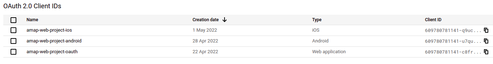

# Documentation relatif à l'authentification

## API Google

L'API OAuth de Google permet de s'authentifier via un compte Google. Cette API renvoie des tokens permettant d'avoir les autorisations souhaitées. Dans le projet, nous nous sommes contentés de récupérer les informations de la personne via l'adresse suivante :

https://oauth2.googleapis.com/tokeninfo?id_token=ID_TOKEN

Plus de détails sont disponibles sur la [page dédiée](https://developers.google.com/identity/protocols/oauth2).

## API Google côté serveur

Nous avons développé une API côté serveur qui permet lorsqu'on se rend sur la [page de login du backend](https://amap-web-project.herokuapp.com/login) de récupérer un **id token**. Ce token sera utile afin de tester nos API via [swagger](https://amap-web-project.herokuapp.com/doc).

Pour ce faire, nous avons dû créer un client OAuth pour web serveur sur Google Cloud Platform.

## API Google côté application

Pour s'authentifier sur l'application, nous utilisons la bibliothèque [react-native-app-auth](https://github.com/FormidableLabs/react-native-app-auth) qui permet d'utiliser les serveurs OAuth de Google notamment.

Nous utilisons ici deux clients OAuth du côté de Google, un pour android et l'autre pour ios.

